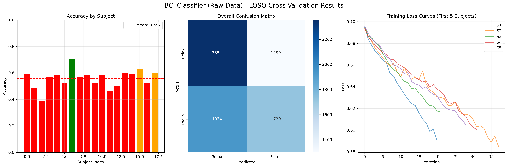
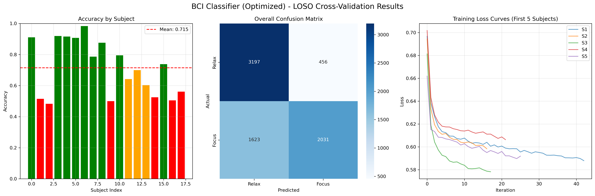
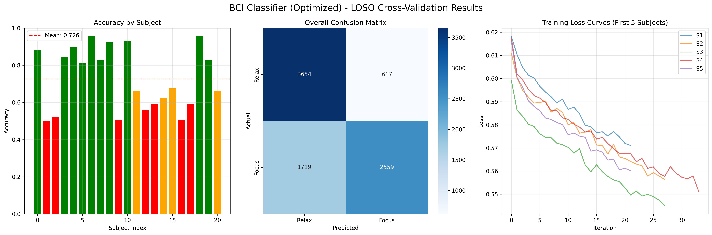
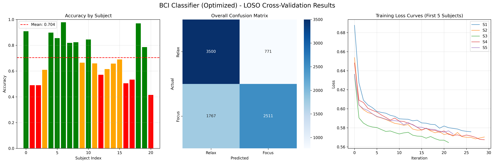

# 114-1 BME Lab 3 - Brain-Computer Interface (BCI) Experiment

This repository contains the code and data for BME Lab 3 experiment focusing on Brain-Computer Interface (BCI) analysis and classification.

## Project Overview

This project contains complete code and datasets for Brain-Computer Interface (BCI) experiments, focusing on EEG signal processing, feature extraction, and classification analysis using neural networks and voting mechanisms.

## File Structure

```
114-1_BME_LAB3_group5/
├── 114_1_gX_exp3_1/          # Experiment 1: Basic Voting Model
│   ├── 114_1_gX_exp3.py     # Main analysis script
│   ├── BCI_raw.py            # Raw BCI data processing
│   ├── bci_results_raw_data.png
│   └── bci_results_voting_data.png
├── 114_1_gX_exp3_2/          # Experiment 2: Enhanced Voting Models
│   ├── 114_1_gX_exp3_2.py   # Enhanced voting mechanism implementation
│   ├── bci_results_voting_data_HT.png
│   └── bci_results_voting_data_personal.png
├── bci_dataset_113-2/         # 113-2 Semester Dataset
│   └── S01-S18/              # Data from 18 subjects
├── bci_dataset_114-1_gX/     # 114-1 Semester Dataset (Group Members)
│   └── b11901180, b12901075, b12901164/  # Data from 3 group members
└── README.md
```

## Experimental Results

### Experiment 1: Basic Voting Model Results
**Dataset**: 113-2 semester data (18 subjects)  
**Model**: Basic voting mechanism with standard parameters





### Experiment 2: Enhanced Voting Models Results
**Dataset**: Combined data from group members (114-1) + 113-2 semester data  
**Models**: 
- **Standard Model**: Same parameters as Experiment 1 voting model
- **HT Model**: Modified layer size for improved performance





## Technical Features

- **Signal Processing**: EEG signal preprocessing and filtering
- **Feature Extraction**: Extracting relevant features from EEG signals
- **Neural Network Classification**: Implementation of deep learning models
- **Voting Mechanism**: Multi-classifier voting to improve accuracy
- **Model Optimization**: Layer size modification for enhanced performance
- **Visualization**: Result charts and data visualization

## Dataset Description

- **bci_dataset_113-2**: Contains EEG data from 18 subjects (113-2 semester)
- **bci_dataset_114-1_gX**: Contains EEG data from 3 group members (114-1 semester)
- Each subject includes data files for two experimental conditions

## Experimental Design

### Experiment 1 (114_1_gX_exp3_1)
- **Purpose**: Establish baseline performance with basic voting model
- **Data**: 113-2 semester dataset only
- **Model**: Standard voting mechanism with default parameters
- **Goal**: Demonstrate basic BCI classification capability

### Experiment 2 (114_1_gX_exp3_2)
- **Purpose**: Improve performance through enhanced models and expanded dataset
- **Data**: Combined dataset (group members + 113-2 semester data)
- **Models**: 
  - Standard model with same parameters as Experiment 1
  - HT model with modified layer size for better outcomes
- **Goal**: Achieve superior classification accuracy through model optimization

## Usage Instructions

1. Ensure necessary Python packages are installed (numpy, pandas, scikit-learn, matplotlib, etc.)
2. Run `114_1_gX_exp3.py` for basic voting model analysis using 113-2 data
3. Run `114_1_gX_exp3_2.py` for enhanced voting models using combined dataset
4. Compare results between standard and HT models
5. View the generated result images for performance evaluation

## Authors

BME Lab 3 Group 5 - 114-1 Semester
